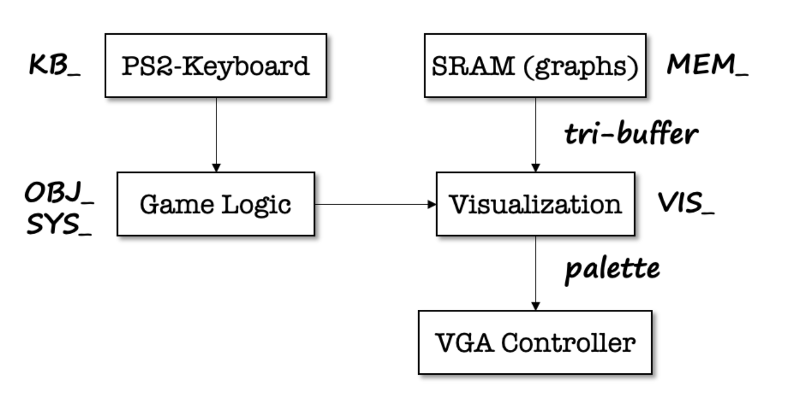
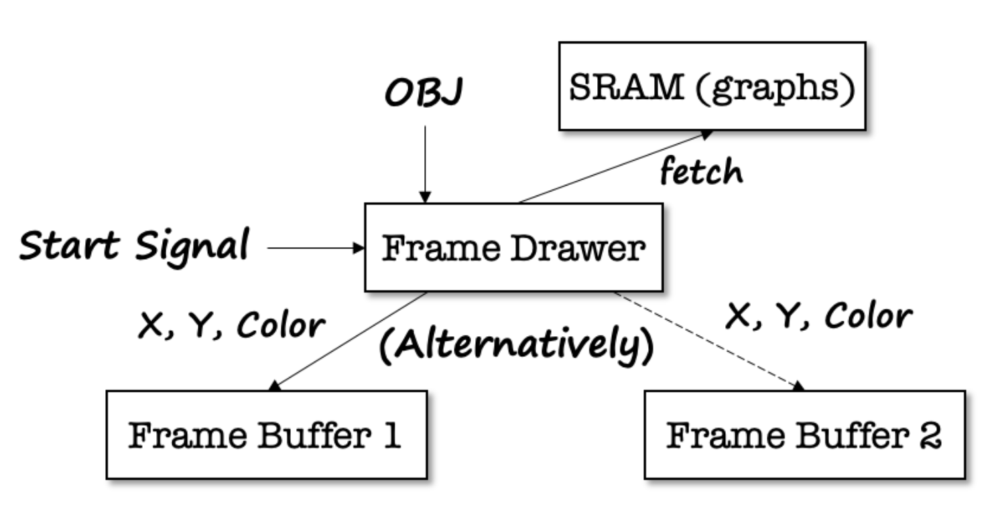
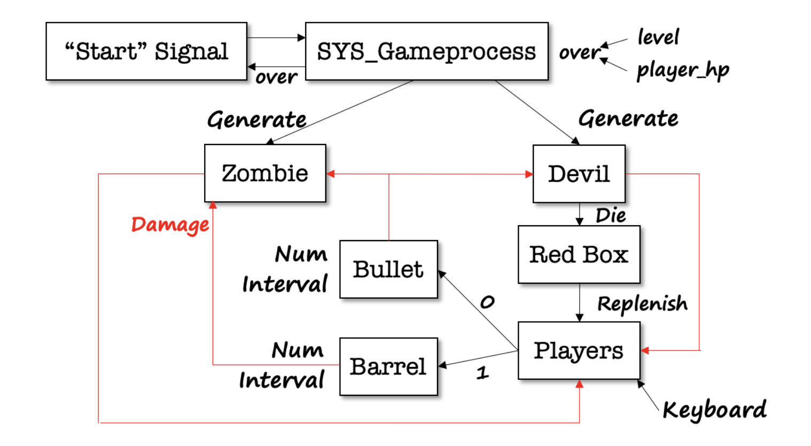

## BOXHEAD : 2 Players 

### Backgrounds:

This is the ECE385 Final Project (Fall 2022) of  the team, Jiazhen Xu & Kailong Jin, based on FPGA (DE2-115 development board).  All codes are finished by Jiazhen Xu in around 2 weeks, except for some tools/interface modules provided by Professors/TAs.

### Instructions:

All the game is implemented using SystemVerilog and needs approximately 20 minutes to finish compilation in Quartus. I only use the SRAM memory to store the graphs.

##### SRAM_Content folder:

It can help you to generate a file with suffix ".ram", which can be further put into the SRAM memory on board:

1. Put your graphs in the "sprite_origin" folder.
2. Run the "png_to_txt_palette.py" and "txt_to_ram.py" consecutively.  
3. You will find your ".ram" file in the "sprite_ram" folder.

Due to the restriction of 3.88Mbits on-chip-memory and 2MB SRAM memory, we only support up to 32(5-bit) colors in the converted file. Our original cutout pictures for the project are all in "sprite_origin", and the ready-made BOXHEAD.ram is in "sprite_ram" for direct use.

##### ZombieCrisis3 folder:

It contains the whole project, in which the top-level file is lab8.sv and all other ".sv" files are in the folder "FILES". The block diagrams are shown below:

Top-Level:Visualization:Game logic:

### Game Settings:

Enter / Esc : Enter and exist from the game.

Player1: Q for changing weapon, WASD for movement, SPACE for attack.

Player2: 1(numpad) for chaging weapon, Direction Key for movement, 5 for attack.

Level: Totally four levels, with more zombies and devils for each level.

Maximum Support: 26 zombies / 10 devils / 3 barrels appears concurrently on the screen , or new ones need to wait until some disappears although having accepted the generation signal.

### Deficiency & Expectations:

As I "solo" all the project from scratch within restricted time, it still has some deficiencies from my point of view:

1. The zombie and player's move/get hitten effects seems a little strange due to the high update frequency (60Hz, same as the frame_drawer). Adding counters to control them may help but pay attention to the problem of signal synchronization.
2. No collision detection for different kind of objects now. In other words, they can stack together. My thought is to build a [1:0] [640*480] collision_map for the use of collision judgement, which stores 0/1/2/3 for every pixel indicating the occupation by Nothing/Zombie/Player/Barrel.  
3. The blood cannot maintain in the background as the original game. What a pity!
4. No fireball for the devil. What a pity!
5. Also, we can add some update elements to the game, e.g. uplock/update weapons according to the level. These can be easily implemented based on current codes.

### Advices for future students:

I will be extremly happy if our project can give you some reference, or at least, you will no more get annoyed by picture cutout work.    In deed, I even encourage you to develop the game based on my version if permitted by policy (But don't forget the necessary citation) 

There are several advices and lessons I learned during the development process:

1. One future development orientation is to incorporate NIOII into the project because the current version have nearly used up all 0.11 million logic elements provided by DE2-115 board. More logic or objects written in SystemVerilog may cause Placing/Routing device fail. Actually, I have already trimmed some functionality to fit my program into the board and I am also tormented by 2-hour compilation when debugging a bigger version.
2. If you fail to find out why some signals generated don't work, turn to construct state machines for your objects! It's really hard to synchronize hundreds of signals and multiple modules under the dominance of two frequency (50MHz Clock_Cycle and 60Hz VGA_VS).
3. If you forget add the argument when instantiating the module in the top-level file, the Quartus won't report it to you but tacitly assigning 0. This may explain some strange behaviors after you are 100 percent sure about the correctness of your logic.

### References:

1. Salute to the original developer, whose game really brings much joy to my childhood.
2. Thanks Kailong Jin, my partner, who cut out all pictures I need from some game videos. Thanks Xinwen Zhu, who gives me some help at the beginning.

